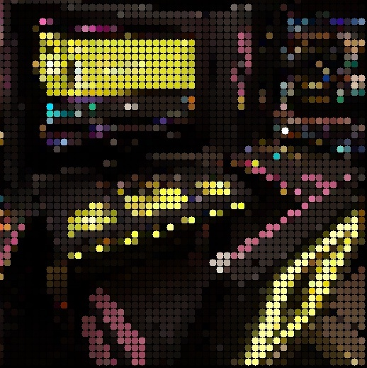
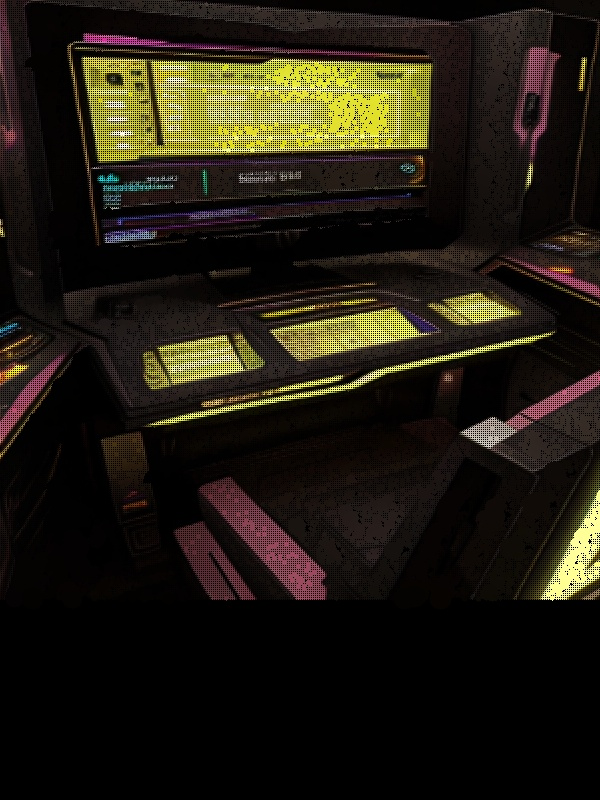

## PixelPaint: Your Creative Playground 

    ._______ .___  ____   ____._______.___    ._______ .______  .___ .______  _________.
    : ____  |: __| \   \_/   /: .____/|   |   : ____  |:      \ : __|:      \ \__ ___.:|
    |    :  || : |  \___ ___/ | : _/\ |   |   |    :  ||   .   || : ||       |  |  :|
    |   |___||   |  /   _   \ |   /  \|   |/\ |   |___||   :   ||   ||   |   |  |   |
    |___|    |   | /___/ \___\|_.: __/|   /  \|___|    |___|   ||   ||___|   |  |   |
             |___|               :/   |______/             |___||___|    |___|  |___|
                                                                                 
                                                                           
Fear changes, embrace the zen of no undo or redo, no layers... just one brush for digital artistry and exploration.

Unleash your inner artist and embark on a journey of digital creativity with PixelPaint. This innovative painting application is more than just a canvas – it's a dynamic playground for artistic experimentation and expression.

Dive into a user-friendly canvas with a range of intuitive tools at your fingertips. Whether you're a seasoned artist or just starting, PixelPaint offers a welcoming environment for all skill levels.

Immersive Color Palette: Choose from a vibrant array of colors to add depth and personality to your artwork. Explore a world of hues to find the perfect shade for your masterpiece.

## Build

In CMakeLists.txt adjust the path to vcpkg or install it with: 

    cd ../../
    mkdir external && cd external 
    gcl git@github.com:microsoft/vcpkg.git
    # windows
    .\vcpkg\bootstrap-vcpkg.bat 
    # unix (linux, macos)
    ./vcpkg/bootstrap-vcpkg.sh   

### Notes

This is a fun and educational project inspired by the 'Paint' Tutorial from dear ImGui by https://github.com/franneck94.
ASCII Logo generated with http://patorjk.com/software/taag/#p=display&h=1&v=0&f=Stronger%20Than%20All&t=PixelPaint%0A

## Example

Imported Image with PointsDrawSize: 10 exported as JPG

Import Image (with Resize checked) and "Smart Repaint" exported as JPG

