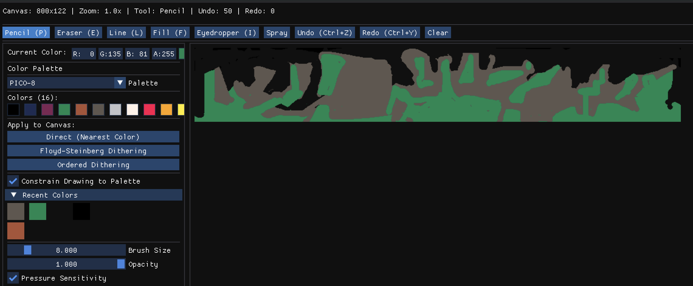

https://q4td.blogspot.com

https://github.com/kubernetes-sigs/headlamp

TODO

Bill Atkinson's dithering algorithm, developed for early Apple Macintosh computers, converts grayscale images to black and white by diffusing quantization error to neighboring pixels in a specific pattern, creating visually rich, high-contrast images on limited monochrome displays. It's an error-diffusion method that spreads only three-quarters of the error, resulting in a broader, more organic pattern than other techniques like Floyd-Steinberg dithering,

Atkinson. Floyd-Steinberg. Stucki.
Indexed, 8-bit PNG export with only the colors you need. Lean, efficient files with pixel-perfect color tables—ideal for web graphics, sprites, or anywhere bytes count.

1-bit, grayscale, and color dithering
Create custom styles
Drag-and-drop simplicity
Accurate, optimized palettes
Indexed, 8-bit PNG export

```
function floyd(pixels,w) {
	const m=[[1,7],[w-1,3],[w,5],[w+1,1]]
	for (let i=0; i<pixels.length; i++) {
		const x=pixels[i], col=x>.5, err=(x-col)/16
		m.forEach(([x,y]) => i+x<pixels.length && (pixels[i+x]+=err*y))
		pixels[i]=col
	}
	return pixels
}

<!-- Note that in this implementation error diffused from the right edge of the image will bleed into the left edge of the following row. The inherent noisyness of dithering makes this aesthetically irrelevant, and doing so simplifies the implementation. Everyone wins!

If we wanted to avoid modifying pixels in-place, we could observe that the accumulated error we care about would fit in a fixed-size circular buffer (e) proportional to the width of our image. The result is slightly more complex, but in some ways conceptually cleaner, since our main loop is now a map(): -->

function floyd2(pixels,w) {
	const e=Array(w+1).fill(0), m=[[0,7],[w-2,3],[w-1,5],[w,1]]
	return pixels.map(x => {
		const pix=x+(e.push(0),e.shift()), col=pix>.5, err=(pix-col)/16
		m.forEach(([x,y]) => e[x]+=err*y)
		return col
	})
}

function atkinson(pixels,w) {
	const e=Array(2*w).fill(0), m=[0,1,w-2,w-1,w,2*w-1]
	return pixels.map(x => {
		const pix=x+(e.push(0),e.shift()), col=pix>.5, err=(pix-col)/8
		m.forEach(x => e[x]+=err)
		return col
	})
}

function atkinson(pixels,w) {
	const m=[[1,1],[w-1,1],[w,1],[w+1,1],[w-1,2],[w,2],[w+1,2]]
	for (let i=0; i<pixels.length; i++) {
		const x=pixels[i], col=x>.5, err=(x-col)/8
		m.forEach(([x,y]) => i+x<pixels.length && (pixels[i+x]+=err*y))
		pixels[i]=col
	}
	return pixels
}
```

```
import sys, PIL.Image

img = PIL.Image.open(sys.argv[-1]).convert('L')

threshold = 128*[0] + 128*[255]

for y in range(img.size[1]):
    for x in range(img.size[0]):

        old = img.getpixel((x, y))
        new = threshold[old]
        err = (old - new) >> 3 # divide by 8

        img.putpixel((x, y), new)

        for nxy in [(x+1, y), (x+2, y), (x-1, y+1), (x, y+1), (x+1, y+1), (x, y+2)]:
            try:
                img.putpixel(nxy, img.getpixel(nxy) + err)
            except IndexError:
                pass

img.show()
```

How it Works
1 Error Diffusion: The algorithm processes pixels, typically top-to-bottom, left-to-right, deciding if each pixel should be black or white (quantization).
2 Calculate Error: The difference (error) between the original pixel's value and its new black/white value is calculated.
3 Distribute Error: This error is then distributed (added) to the surrounding unquantized pixels according to a specific pattern, using a fraction (1/8th) of the error for each affected neighbor.
4 Atkinson's Pattern: The distinctive part is the distribution pattern, which sends 3/4 of the error outward (6 neighbors \* 1/8 each), leading to smoother gradients and increased contrast compared to other methods,

Visual Style: Produces images with excellent contrast and sharp edges, characteristic of classic Mac software like MacPaint.
Error Distribution: Diffuses error to neighbors in a broad, specific pattern, unlike simpler methods that might just use a fixed threshold.
Nostalgia: Its association with early Macintosh computers makes it a popular choice for nostalgic effects in modern applications.

## Drop Image on Web und Desktop

Sokol example via https://github.com/floooh/qoiview/blob/main/qoiview.c

#if defined(**EMSCRIPTEN**)
static void emsc_dropped_file_callback(const sapp_html5_fetch_response\* response) {
if (response->succeeded) {
state.file.error = SFETCH_ERROR_NO_ERROR;
create_image(response->data.ptr, response->data.size);
}
else {
switch (response->error_code) {
case SAPP_HTML5_FETCH_ERROR_BUFFER_TOO_SMALL:
state.file.error = SFETCH_ERROR_BUFFER_TOO_SMALL;
break;
case SAPP_HTML5_FETCH_ERROR_OTHER:
state.file.error = SFETCH_ERROR_FILE_NOT_FOUND;
break;
default: break;
}
}
}
#endif

static void start_load_file(const char\* path) {
sfetch_send(&(sfetch_request_t){
.path = path,
.callback = load_callback,
.buffer = SFETCH_RANGE(state.file.buf),
});
}

static void start_load_dropped_file(void) {
#if defined(**EMSCRIPTEN**)
sapp_html5_fetch_dropped_file(&(sapp_html5_fetch_request){
.dropped_file_index = 0,
.callback = emsc_dropped_file_callback,
.buffer = SAPP_RANGE(state.file.buf),
});
#else
const char\* path = sapp_get_dropped_file_path(0);
start_load_file(path);
#endif
}

static const char\* error_as_string(void) {
if (state.file.qoi_decode_failed) {
return "Not a valid .qoi file (decoding failed)";
}
else switch (state.file.error) {
case SFETCH_ERROR_FILE_NOT_FOUND: return "File not found";
case SFETCH_ERROR_BUFFER_TOO_SMALL: return "Image file too big";
case SFETCH_ERROR_UNEXPECTED_EOF: return "Unexpected EOF";
case SFETCH_ERROR_INVALID_HTTP_STATUS: return "Invalid HTTP status";
default: return "Unknown error";
}
}

## SceneGraph Animations?

https://github.com/WEREMSOFT/SDL2SchenegraphC99/blob/master/src/scenegraph.h

void node_add_behavior(struct node_t* node, behavior_function_t* behavior)
{
node->behaviors = realloc(node->behaviors, sizeof(node_t) \* ++node->behavior_count);
node->behaviors[node->behavior_count-1] = behavior;
}
// usage
node_add_behavior(ship, ship_update);

## Eraser Bucket with Treshold to Alpha

## Layers Tree

Layer Tools:
Layer Tools: Smart default for Pixel Art PixelPerfect Redraw?) : Rotate, scale, crop

- PixelPerfect Redraw? : Rotate, scale, crop
- Graphics2D: affine transfrom : Rotate, scale, crop

## Text?

## Generatoren?

## RemoveBG?

## PixelPaint: Your Creative Playground

    ._______ .___  ____   ____._______.___    ._______ .______  .___ .______  _________.
    : ____  |: __| \   \_/   /: .____/|   |   : ____  |:      \ : __|:      \ \__ ___.:|
    |    :  || : |  \___ ___/ | : _/\ |   |   |    :  ||   .   || : ||       |  |  :|
    |   |___||   |  /   _   \ |   /  \|   |/\ |   |___||   :   ||   ||   |   |  |   |
    |___|    |   | /___/ \___\|_.: __/|   /  \|___|    |___|   ||   ||___|   |  |   |
             |___|               :/   |______/             |___||___|    |___|  |___|

Fear changes, embrace the zen of undo or redo, no layers... just one brush for digital artistry and exploration.

Unleash your inner artist and embark on a journey of digital creativity with PixelPaint. This innovative painting application is more than just a canvas – it's a dynamic playground for artistic experimentation and expression.

Dive into a user-friendly canvas with a range of intuitive tools at your fingertips. Whether you're a seasoned artist or just starting, PixelPaint offers a welcoming environment for all skill levels.

Immersive Color Palette: Choose from a vibrant array of colors to add depth and personality to your artwork. Explore a world of hues to find the perfect shade for your masterpiece.

## Example



## Build

# macOS (tested and working!)

./scripts/dev.sh run-macos

# iOS Device

./scripts/dev.sh ios

# iOS Simulator

./scripts/dev.sh ios-sim

# Web (requires Emscripten)

./scripts/dev.sh run-web

### Notes

This is a fun and educational project inspired by the 'Paint' Tutorial from dear ImGui by https://github.com/franneck94.
ASCII Logo generated with http://patorjk.com/software/taag/#p=display&h=1&v=0&f=Stronger%20Than%20All&t=PixelPaint%0A

Built with ❤️ using SDL3, Dear ImGui, and modern C++
