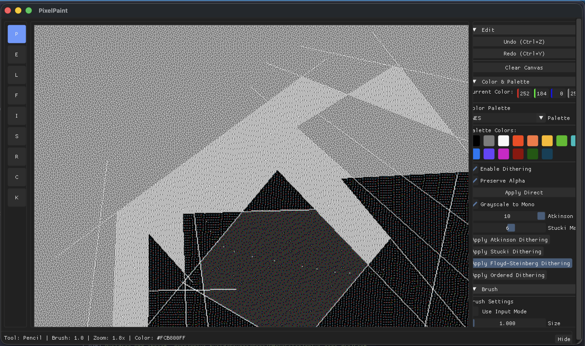
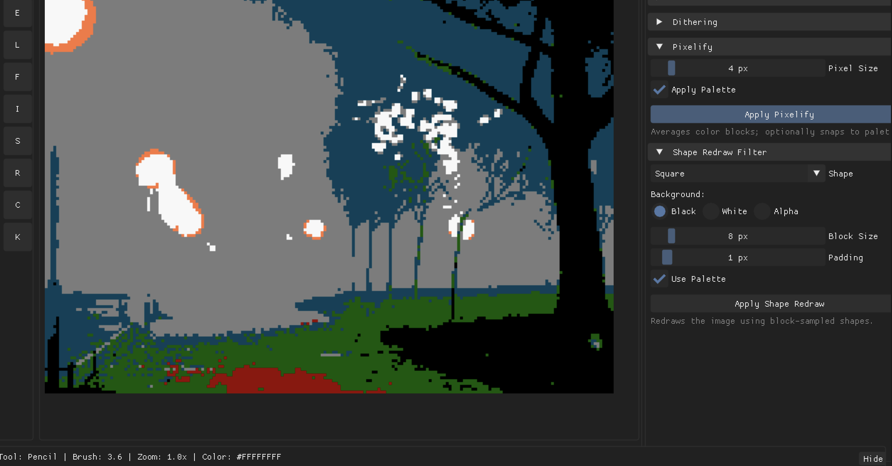

## PixelPaint: Your Creative Playground

    ._______ .___  ____   ____._______.___    ._______ .______  .___ .______  _________.
    : ____  |: __| \   \_/   /: .____/|   |   : ____  |:      \ : __|:      \ \__ ___.:|
    |    :  || : |  \___ ___/ | : _/\ |   |   |    :  ||   .   || : ||       |  |  :|
    |   |___||   |  /   _   \ |   /  \|   |/\ |   |___||   :   ||   ||   |   |  |   |
    |___|    |   | /___/ \___\|_.: __/|   /  \|___|    |___|   ||   ||___|   |  |   |
             |___|               :/   |______/             |___||___|    |___|  |___|

Fear changes, embrace the zen of undo or redo, stacked layers... just one brush for digital artistry and exploration.

Unleash your inner artist and embark on a journey of digital creativity with PixelPaint. This innovative painting application is more than just a canvas – it's a dynamic playground for artistic experimentation and expression.

Dive into a user-friendly canvas with a range of intuitive tools at your fingertips. Whether you're a seasoned artist or just starting, PixelPaint offers a welcoming environment for all skill levels.

Immersive Color Palette: Choose from a vibrant array of colors to add depth and personality to your artwork. Explore a world of hues to find the perfect shade for your masterpiece.

## Example

## Build

# macOS

./scripts/dev.sh run-macos

# iOS Device

./scripts/dev.sh ios

# iOS Simulator

./scripts/dev.sh ios-sim

# Web (requires Emscripten)

./scripts/dev.sh run-web

## Notes

This is a fun project inspired by the 'Paint' Tutorial from dear ImGui by https://github.com/franneck94.
ASCII Logo generated with http://patorjk.com/software/taag/#p=display&h=1&v=0&f=Stronger%20Than%20All&t=PixelPaint%0A

    Built with <3 using SDL3, Dear ImGui, and modern C++

CLI:

`cd tools/pelpaint_cli && mkdir -p build && cd build && cmake .. && make`

## Export

- SVG Export uses greedy rectangle merging algorithm
- Mesh uses depth sampling, masking triangulation / extrusion

## iOS

### Simulator (fastest)

    ./scripts/dev.sh ios-sim
    open -a Simulator
    xcrun simctl install booted \
    build/ios-simulator-Release/Release-iphonesimulator/PixelPaint.app
    xcrun simctl launch booted com.pixelpaint.app

### Physical iPad via Xcode (recommended)

    mkdir -p build/ios-Release && cd build/ios-Release
    cmake ../.. -DCMAKE_SYSTEM_NAME=iOS -DCMAKE_OSX_ARCHITECTURES="arm64" \
    -DCMAKE_OSX_DEPLOYMENT_TARGET="14.0" -DIOS=TRUE -G "Xcode"
    open PixelPaint.xcodeproj

→ set team in Signing & Capabilities → plug in iPad → ⌘R

### Physical iPad fully CLI

replace YOURTEAMID:

    cmake ../.. -DCMAKE_SYSTEM_NAME=iOS -DCMAKE_OSX_ARCHITECTURES="arm64" \
    -DCMAKE_OSX_DEPLOYMENT_TARGET="14.0" \
    -DCMAKE_XCODE_ATTRIBUTE_CODE_SIGN_IDENTITY="Apple Development" \
    -DCMAKE_XCODE_ATTRIBUTE_DEVELOPMENT_TEAM="YOURTEAMID" \
    -DCMAKE_XCODE_ATTRIBUTE_CODE_SIGNING_REQUIRED=YES \
    -DIOS=TRUE -G "Xcode"
    cmake --build . --config Release -- -allowProvisioningUpdates
    xcrun devicectl device install app \
    --device 821A075B-02A8-53E4-99FD-AF2F15861535 \
    Release-iphoneos/PixelPaint.app
